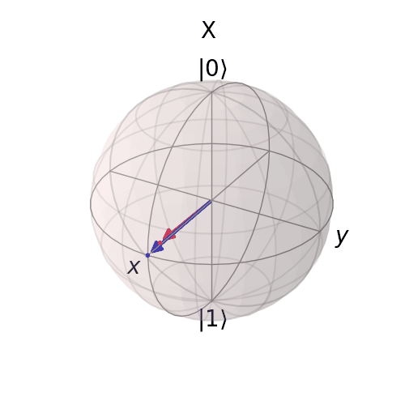
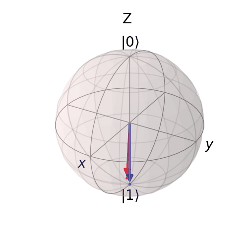
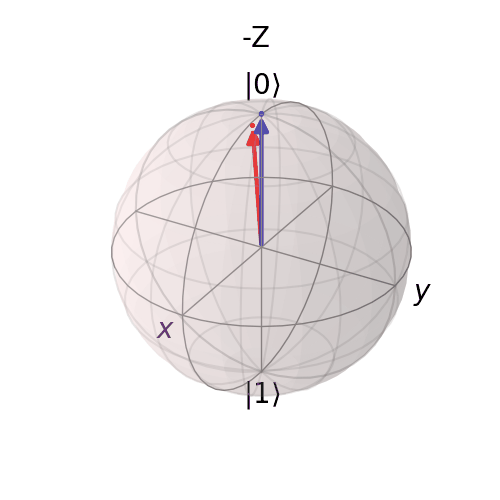
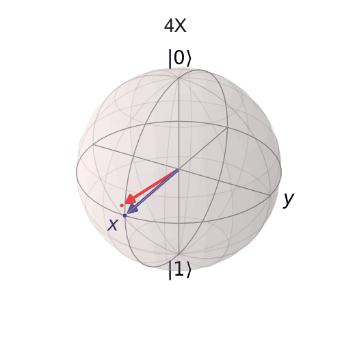
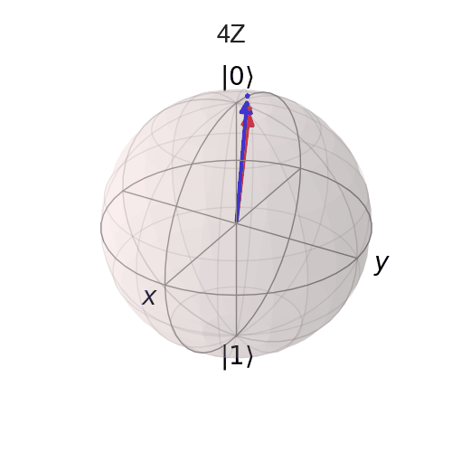

# Online supplementary material: Relaxation times do not capture logical qubit dynamics

This supplementary information features animated representation of the Bloch sphere for the manuscript "Relaxation times do not capture logical qubit dynamics"

## 3 qubit encoding

Bloch sphere corresponding to 3 qubit encoding, initially in the +X eigenstate (Fig. 2a). Theoretically predicted vectors are shown in blue, whereas experimental data is red. 

-----

Bloch sphere corresponding to 3 qubit encoding, initially in the +Z eigenstate (Fig. 2b). Theoretically predicted vectors are shown in blue, whereas experimental data is red. 

-----

Bloch sphere corresponding to 3 qubit encoding, initially in the +Z eigenstate (Fig. 2b). Theoretically predicted vectors are shown in blue, whereas experimental data is red. 

### 4 qubit encoding

Bloch sphere corresponding to 3 qubit encoding, initially in the +Z eigenstate (Fig. 3a). Theoretically predicted vectors are shown in blue, whereas experimental data is red. 

-----

Bloch sphere corresponding to 3 qubit encoding, initially in the +Z eigenstate (Fig. 3b). Theoretically predicted vectors are shown in blue, whereas experimental data is red. 

